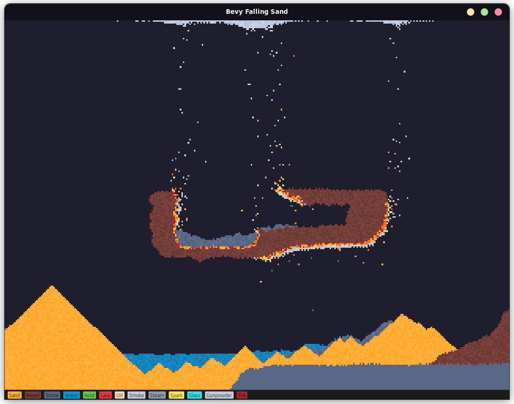

# Falling Sand Simulation

Inspired by Noita, simple falling sand simulation built with Rust and Bevy.

The simulation could be chunk-based to improve performances.

## References

- [Noita - a roguelite in which every pixel is simulated](https://noitagame.com/)

---

- [bevyengine/bevy: A refreshingly simple data-driven game engine built in Rust](https://github.com/bevyengine/bevy)
- [mvlabat/bevy\_egui](https://github.com/mvlabat/bevy_egui)
- [John Jackson - Recreating Noita's Sand Simulation in C and OpenGL | Game Engineering - YouTube](https://www.youtube.com/watch?v=VLZjd_Y1gJ8)
